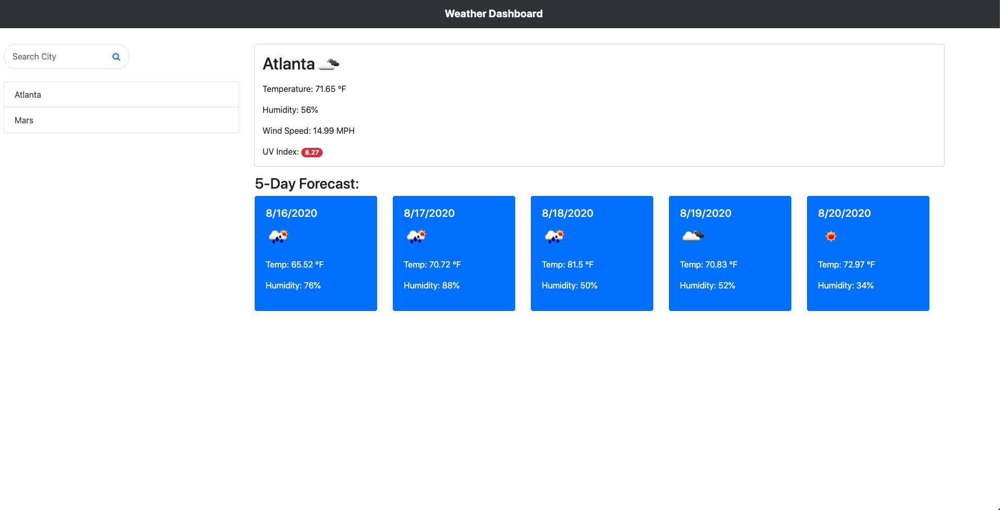

# Weather Dashboard

## Description 

This is a weather dashboard application that uses the [OpenWeather API](https://openweathermap.org/api) to retrieve weather data for cities, and uses `localStorage` to store persistent data, while featuring dynamically updated HTML and CSS. 

## Weather Dashboard Preview

## Github Pages Link

You can view the deployed site at https://dpan-5.github.io/hw-06-weather-dashboard/

## Functionality

When a user opens the application for the first time, a search bar is displayed where they can search for weather by city.

Weather conditions, including temperature, humidity, wind speed, and UV index, for a searched city is presented and a 5-day forecast is also displayed.

Past searches are also saved and populated within the sidebar, allowing the user to select past searched cities.

## License

MIT License

Copyright (c) 2020 David Pan

Permission is hereby granted, free of charge, to any person obtaining a copy
of this software and associated documentation files (the "Software"), to deal
in the Software without restriction, including without limitation the rights
to use, copy, modify, merge, publish, distribute, sublicense, and/or sell
copies of the Software, and to permit persons to whom the Software is
furnished to do so, subject to the following conditions:

The above copyright notice and this permission notice shall be included in all
copies or substantial portions of the Software.

THE SOFTWARE IS PROVIDED "AS IS", WITHOUT WARRANTY OF ANY KIND, EXPRESS OR
IMPLIED, INCLUDING BUT NOT LIMITED TO THE WARRANTIES OF MERCHANTABILITY,
FITNESS FOR A PARTICULAR PURPOSE AND NONINFRINGEMENT. IN NO EVENT SHALL THE
AUTHORS OR COPYRIGHT HOLDERS BE LIABLE FOR ANY CLAIM, DAMAGES OR OTHER
LIABILITY, WHETHER IN AN ACTION OF CONTRACT, TORT OR OTHERWISE, ARISING FROM,
OUT OF OR IN CONNECTION WITH THE SOFTWARE OR THE USE OR OTHER DEALINGS IN THE
SOFTWARE.